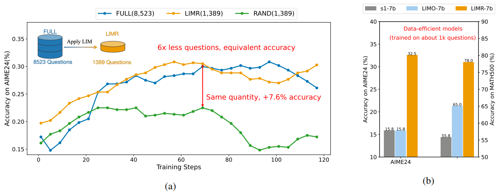

<div align="center">

# LIMR: Less is More for RL Scaling

</div>


<p align="center">
  📄 <a href="https://github.com/GAIR-NLP/LIMR/blob/master/Less_is_More_for_RL_Scaling.pdf" target="_blank">Paper</a> &nbsp; | &nbsp;
  🌐 <a href="https://huggingface.co/datasets/GAIR/LIMR" target="_blank">Dataset</a> &nbsp; | &nbsp;
  📘 <a href="https://huggingface.co/GAIR/LIMR" target="_blank">Model</a>
</p>


<div align="center">

</div>

> (a) The accuracy on AIME24 across using different training datasets in RL **without any data distillation and SFT training as cold start**. Our specifically curated LIMR dataset, a strategically selected subset from the full dataset, MATH (level 3-5), achieved comparable accuracy levels while utilizing less than one-sixth of the data volume. Notably, LIM significantly outperformed a randomly selected dataset of equivalent size, demonstrating the effectiveness of our selective dataset construction methodology. (b) A comparison of different data-efficient models.


## Releases

[2025/02/17] We're releasing the following components:

- 🛠️ **LIM Tools**: Implementation of our **Learning Impact Measurement** methodology
- 🚀 **Training & Evaluation**: Complete implementation of our training pipeline and evaluation scripts
- 🔥 **[LIMR Dataset](https://huggingface.co/datasets/GAIR/LIMR)**: Our curated dataset of 1,389 mathematical questions
- 🤖 **[LIMR Model](https://huggingface.co/GAIR/LIMR)**: Model training on the LIMR dataset.

## Overview

This repository presents **LIMR**, an approach that challenges the assumption about data scaling in reinforcement learning for LLMs. We demonstrate that the quality and relevance of training samples matter far more than their quantity. Our **Learning Impact Measurement (LIM)** methodology enables automated evaluation of training sample effectiveness, eliminating the need for manual curation while achieving **comparable or superior** results with **6x less** data. Notably, all our investigations are conducted directly from base models without distillation, providing clear insights into the core dynamics of RL training.


Our key findings revolutionize the understanding of RL training dynamics:

- A strategically selected subset of training samples (1,389) can achieve comparable or even superior performance compared to training with the full dataset (8,523), fundamentally challenging the assumption that larger datasets necessarily lead to better performance.
- We introduce Learning Impact Measurement (LIM), an automated quantitative method for probing the potential value of RL training samples, enabling systematic analysis of how different samples contribute to model improvement.
- While distilled long-form reasoning data has shown efficiency in larger models, at the scale of ~1K samples with small models (7B), our data-efficient RL approach significantly outperforms SFT with distilled data.
- The path to better reasoning capabilities may not lie in simply scaling up RL training data, but rather in being more selective about which samples to use.


Performance across challenging mathematical benchmarks:

| Method | #Questions | AIME2024 | MATH500 | AMC2023 | AVG. |
|--------|------------|-----------|----------|-----------|-------|
| Qwen-Math-7B | - | 16.7 | 52.4 | 52.5 | 40.5 |
| Qwen-Math-7B-FULL | 8,523 | 32.5 | 76.6 | 61.9 | 57.0 |
| Qwen-Math-7B-RAND | 1,389 | 25.8 | 66.0 | 56.3 | 49.4 |
| Qwen-Math-7B-LINEAR | 1,138 | 28.3 | 74.6 | 61.9 | 54.9 |
| LIMR | 1,389 | **32.5** | **78.0** | **63.8** | **58.1** |

Comparsion with other popular RL recipes. We apply RL directly from the base model, without using distilled long chain-of-thought data from larger or stronger models, and only use 1k questions.
| Methods   | Init Model | Long CoT Dis. | #Questions |
|-----------|------------|---------------|------------|
| STILL-3   | Instruct   | Yes           | 29,925        |
| DeepScaleR| Instruct   | Yes           | 40,314        |
| Sky-T1    | Instruct   | Yes           | 45,000        |
| THUDM-T1  | Instruct   | No            | 30,000        |
| PRIME     | Instruct   | No            | 150,000       |
| SimpleRL  | Base       | No            | 8,523         |
| LIMR      | Base       | No            | 1,389         |


## Quick Start

### Data Selection with LIM(optional)

```bash
# RUN RL training with MATH-FULL dataset
bash scripts/train_math.8k.sh
```

```bash
# Select data using LIM method

#!/bin/bash
python lim_selection.py \
    --train_samples_path ./data/output/math.8k \
    --original_prompts_path ./data/prompts/math8k.json \
    --output_path ./data/prompts/limr.json \
    --steps_per_epoch 8 \
    --max_epochs 21 \
    --similarity_threshold 0.6
```

### RL Training with LIMR dataset

```bash
# Run RL training with LIMR dataset
bash scripts/train_limr.sh
```

### Evaluation

```bash
# Evaluate on benchmarks
cd eval
python eval.sh --run_path run/ckpts/path --step step_of_ckpts
```

## Acknowledgements

Our work builds upon the insightful technical reports from [DeepSeek R1](https://github.com/deepseek-ai/DeepSeek-R1) and [Kimi-k1.5](https://github.com/MoonshotAI/Kimi-k1.5) teams. We extend our appreciation to the [Qwen-Math](https://github.com/QwenLM/Qwen2.5-Math) team for their open-source model, and to the creators of [OpenRLHF](https://github.com/OpenRLHF/OpenRLHF) and [vLLM](https://github.com/vllm-project/vllm) for providing the essential reinforcement learning framework and inference infrastructure, respectively, that enabled this research.

## Citation

If you find this work useful, please cite our paper:

```bibtex

@misc{limr2025,
  author = {Li, Xuefeng and Zou, Haoyang and Liu, Pengfei},
  title = {LIMR: Less is More for RL Scaling},
  year = {2025},
  publisher = {GitHub},
  journal = {GitHub repository},
  howpublished = {\url{https://github.com/GAIR-NLP/LIMR}},
}
```


